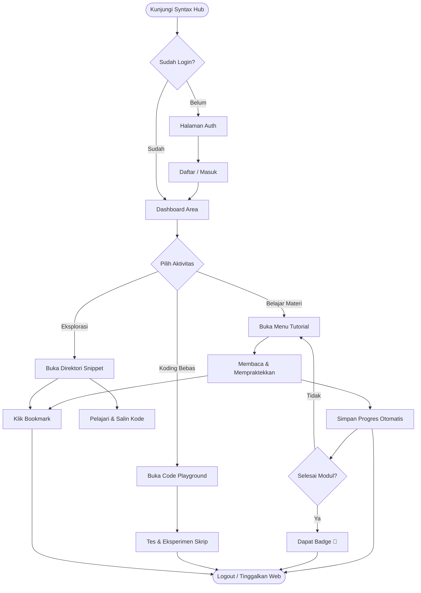
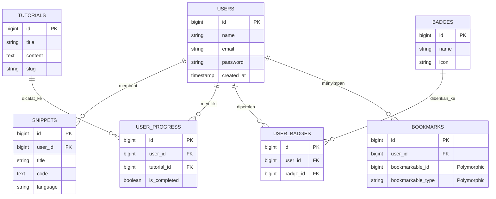
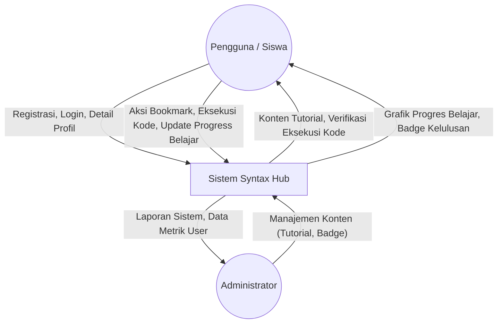

# 🚀 Syntax Hub (Web Learning Hub)

Syntax Hub adalah platform edukasi interaktif modern (EdTech) yang dikembangkan untuk memudahkan pengguna dalam mempelajari pemrograman dan ekosistem terkait web. Melalui perpaduan materi pembelajaran yang terstruktur, *code playground*, koleksi *snippet*, serta sistem gamifikasi (*badge & progress*), platform ini ditujukan untuk menjadi ekosistem belajar yang komprehensif bagi developer dari berbagai tingkatan.

Platform ini dibangun di atas pondasi *monolith* modern yang memanfaatkan integrasi mulus antara backend dan frontend:
- **Backend:** Laravel 11 (PHP)
- **Frontend Utama:** React 18 & Inertia.js (menghubungkan Laravel & React tanpa REST API terpisah)
- **Styling:** Tailwind CSS (dikustomisasi penuh untuk *glassmorphism* dan *dark mode* premium)
- **Animasi:** Framer Motion (untuk transisi halaman, efek kartu, indikator kustom)
- **Fitur Interaktif:** CodeMirror 6 (menjadi mesin utama di balik *Code Playground*) & Recharts (untuk visualisasi data progres)

---

## 📌 Fitur Ekosistem Utama

1. **Autentikasi & Dashboard:** Sistem registrasi & login interaktif. Setelah masuk, *Dashboard* menampilkan ringkasan profil, modul yang sedang dipelajari, dan metrik pembelajaran.
2. **Modul Belajar (Tutorials):** Basis pengetahuan utama berbasis teori dan praktik.
3. **Interactive Code Playground:** Editor kode secara *real-time* dengan *syntax highlighting* di mana siswa dapat langsung menulis dan mengeksekusi kode (HTML/CSS/JS/Python) untuk membuktikan teori yang dibaca.
4. **Snippets Library:** Repositori kode-kode praktis dan fungsional yang bisa disimpan, ditinjau ulang, dan disalin pengguna.
5. **Sistem Progres & Gamifikasi:** 
   - *User Progress:* Perekaman otomatis sampai bagian modul mana siswa belajar.
   - *Badges:* Penghargaan (lencana digital) yang diberikan secara otomatis jika pengguna merampungkan *milestone* atau kondisi eksplorasi tertentu.
6. **Sistem Bookmark:** Fitur pendukung agar pengguna dapat menyimpan artikel (*Tutorial*) atau kumpulan *Snippet* untuk diakses dengan mudah tanpa harus mencarinya lagi.

---

## 🗺️ Diagram Sistem

Berikut adalah rancangan diagram sistem yang menopang arsitektur **Syntax Hub**, divisualisasikan menggunakan format Mermaid.

### 1. Flowchart Pengguna (User Journey Flow)
Menggambarkan alur interaksi logis dari pengguna saat pertama kali mengunjungi hingga menyelesaikan suatu modul dalam Syntax Hub.

### 2. Entity Relationship Diagram (ERD)
Struktur skema relasional tabel dalam *database* (berbasis migrasi Laravel) yang mengatur konten dan data pengguna.

### 3. Data Flow Diagram (DFD Level 0 / Context Diagram)
Representasi makro aliran data antara *Entitas Luar* dengan inti sistem *Syntax Hub*.

---
*Dokumentasi ini telah diperbarui untuk mencerminkan rancangan ekosistem Web Learning Hub (Syntax Hub).*
